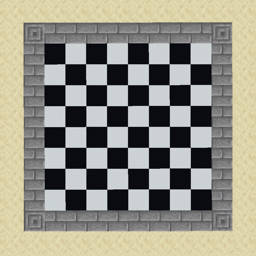
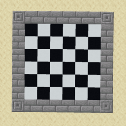

# MINES (MINE CHESS)

### Описание

Игра формата заполнения, где игроки по очереди ставят один из блоков заранее выданного набора. За установку каждый получает соответсвующие баллы, и по окончании игры побеждает тот, у кого их осталось меньше всего. 

### Ссылки по игре

* [**Набор правил**](./RULES.md)
* [**Список блоков**](./BLOCKS.md)

### Подготовка

* Игровое поле, например размером 8x8 или 6x6 блоков

    
 8x8 

    
 6x6 

* Набор блоков в сооветствии с каким либо [набором правил](./RULES.md)

* Место где будет записываться счет каждого игрока

### Ход игры

* Выбирается игрок, который получает право первого хода

* Блоки ставятся по очереди (Сначала шерсть с рамкой, потом блок, чтобы не было нужды в инструментах)

* Чтобы не путаться в оставшихся блоках, на время разрушения блоков, свои убирать в пустой сундук

* Когда ставится последний блок, побеждает игрок с наибольшим количеством баллов